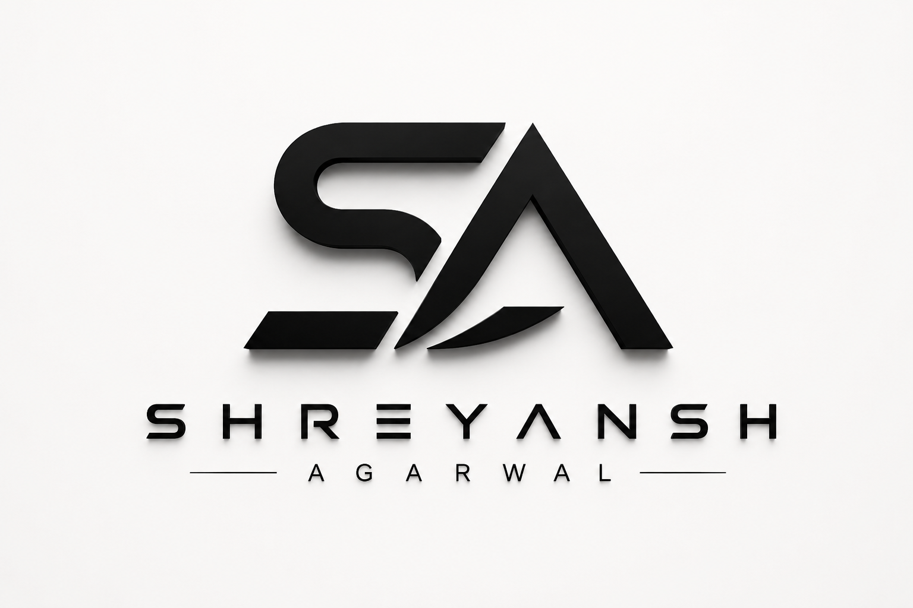

<!-- Profile README: place this repository at github.com/shreyanshz04b/shreyanshz04b -->

  

**Profiles & destinations**

[GitHub](https://github.com/shreyanshz04b) · [LinkedIn](https://www.linkedin.com/in/shreyanshagarwalceo/) · [Instagram](https://instagram.com/shreyanshagarwaloffical) · [Portfolio](https://shreyanshportfolio.in/) · [X](https://x.com/ShreyanshAg_in) · [Medium](https://medium.com/@shreyanshagarwalofficial) · [Behance](https://www.behance.net/shreyansh-agarwal) · [Stack Overflow](https://stackoverflow.com/users/27209418) · [Quora](https://quora.com/profile/Shreyansh-Agarwal-163) · [Pinterest](https://in.pinterest.com/shreyanshagarwalofficial/) · [Facebook](https://facebook.com/@shreyanshagarwalofficial)

## Selected projects

| Project | Description | Technologies | Repository / Website |
|---|---|---|---|
| **SmartHireTalent** | AI-powered recruitment and interview platform focused on resume intelligence, recruitment workflows, and RAG-based capabilities. | RAG and AI capabilities; complete project here. | [Portfolio](https://shreyanshportfolio.in/) · |
| **ClauseIQ** | Legal information retrieval, document analysis, case-law discovery, and AI-assisted legal guidance. | Legal AI and retrieval; complete project  | Repository not Available |
| **AI Suite Labs** | Editorial publication covering AI, LLMs, automation, cybersecurity, programming, web development, and emerging technology. | Editorial technology publication; Stack Unavailable . | [Website](https://aisuitelabs.com/) · |

  

Shreyansh Agarwal · Agra, Uttar Pradesh, India

